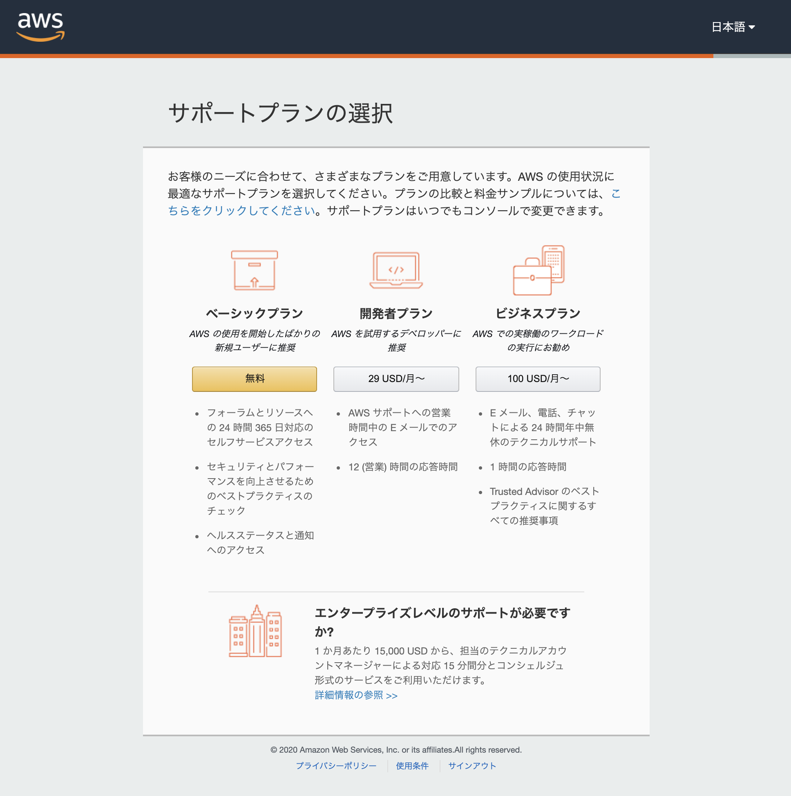
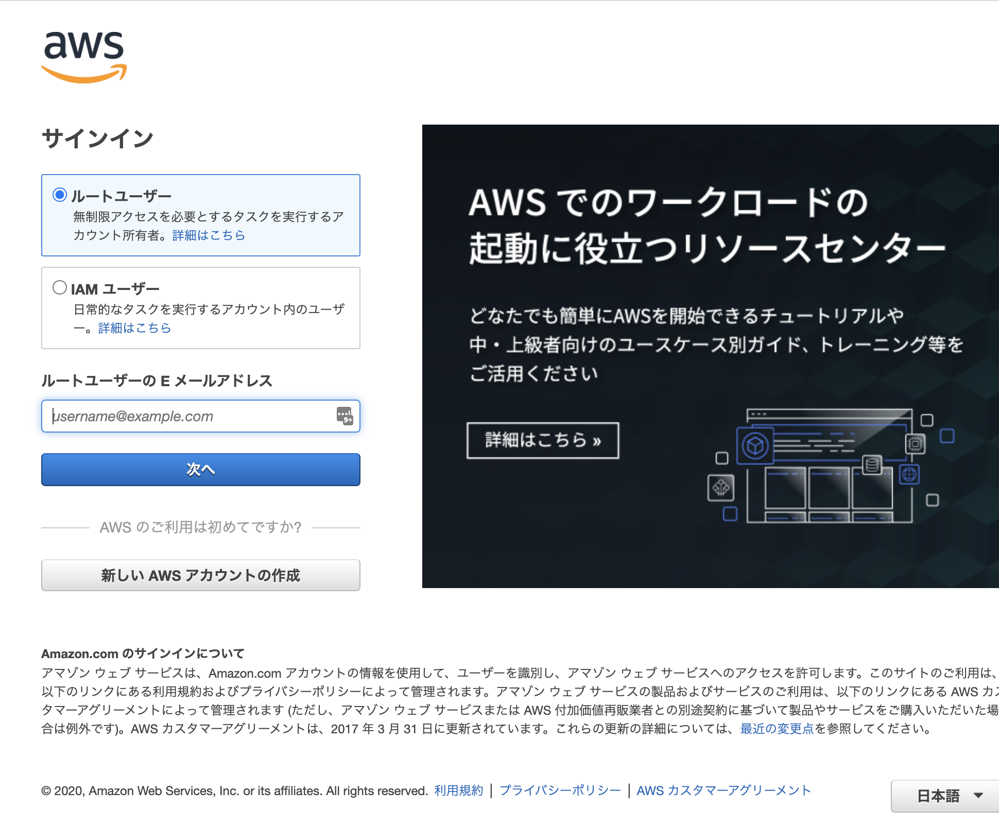
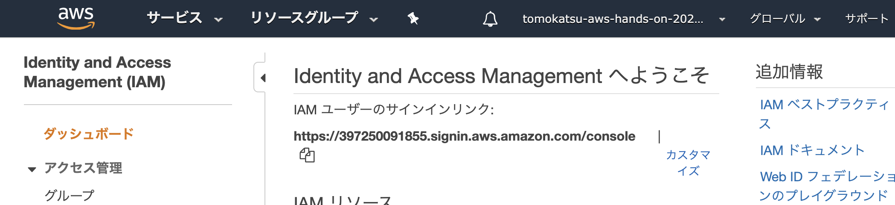

# Step 1: AWS アカウントを準備しよう

# AWS アカウント作成...の前に
## パスワードの管理について
* 以降の手順では、いくつかパスワードを用意していただくことがあります
* AWSに限ったことではなく、多くのWebサービスを利用する上で、パスワードは必要になってきます
* そんなパスワードをセキュアに管理する意識は、エンジニアに限らず必須のリテラシーです

## おすすめのパスワード管理方法
* [パスワードマネージャー（Wikipedia）](https://ja.wikipedia.org/wiki/%E3%83%91%E3%82%B9%E3%83%AF%E3%83%BC%E3%83%89%E3%83%9E%E3%83%8D%E3%83%BC%E3%82%B8%E3%83%A3%E3%83%BC)を活用しましょう
  * 例
    * Lastpass
    * 1Password
    * Web ブラウザのパスワード記憶機能
* このハンズオンでは以下の観点で Lastpass を推奨します
  * 無料で使える
  * マスターパスワードが設定できる
    * マスターパスワードは十分にセキュアな文字列を別途用意、管理する必要がある
  * MFAの設定できる
  * オートコンプリート機能が一定時間で無効化され、再認証が必要になる
  * オートコンプリート機能が有効であっても、再認証を求めるような設定が個別にできる
  * ローカルにパスワードが保存されない
* みなさん任意のパスワードマネージャーを使って、パスワードを保護しましょう
### 参考資料
* [Chrome などで保存したパスワードが丸見えだから危険とか言われている件について](https://hyper-text.org/archives/2013/08/chrome_password_security.shtml)

## MFA
* MFAとは[多要素認証 (Wikipedia)](https://ja.wikipedia.org/wiki/%E5%A4%9A%E8%A6%81%E7%B4%A0%E8%AA%8D%E8%A8%BC)
のことです
* AWS や多くの　Web サービスで利用可能な多要素には`知る要素`、`持つ要素`があります
  * 知る要素: パスワード
  * 持つ要素: ワンタイムパスワード生成装置
    * デバイス
      * [Yubikey](https://www.yubico.com/)
    * スマートフォンアプリ
      * [Authy](https://authy.com/)
      * [Google Authenticator](https://support.google.com/accounts/answer/1066447)
    * SMS
* このハンズオンでは Authy の利用を推奨します
* 普段利用している Web サービスで MFA が利用できる場合は積極的に利用しましょう

# AWS アカウントの作成
* https://portal.aws.amazon.com/billing/signup#/start
  * E メールアドレス
  * パスワード
  * パスワードの確認
  * AWS アカウント名
* 連絡先情報
  * アカウントの種類: パーソナル
  * 電話番号: 個人の電話番号を入力
  * 国/地域: 任意
  * アドレス: 任意
  * 市区町村: 任意
  * 都道府県または地域: 任意
  * 郵便番号: 任意
  * AWSカスタマーアグリーメントの諸条件を...: チェックする
  * アカウントを作成して続行ボタンをクリック
* 支払い情報
  * クレジットカード情報の入力
* 本人確認
  * SMS か 音声通話を利用して本人確認を実施
* サポートプランの選択
  * ベーシックプラン（無料）を選択
  * 
* アマゾンウェブサービスへようこそ
  * コンソールにサインインボタンをクリック

# サインイン
* https://console.aws.amazon.com/console/home
  * 
* ルートユーザを選択
* ルートユーザの E メールアドレス: 登録時に設定したアドレスを記入
* 次へボタンをクリック
* パスワード: 登録時に設定したパスワードを記入
* サインインボタンをクリック

# アカウントエイリアスを設定
* https://console.aws.amazon.com/iam/home?#/home
* カスタマイズというリンクをクリック
  * 
* アカウントの別名を作成というポップアップが出る
  * アカウントエイリアス: 世界中の AWS アカウントがユニークに特定される必要があることに留意しつつ、任意のエイリアス名を記入
* はい、作成するボタンをクリック
