# Step 2: AWS アカウントを安全に安心して利用するために

# 請求情報のアラーム設定
* お金がかかっても気付けるよう、メールに通知する設定を入れておく
* Billing の設定を実施
  * https://console.aws.amazon.com/billing/home?#/preferences
  * 以下のようにチェックを入れて保存する
    * 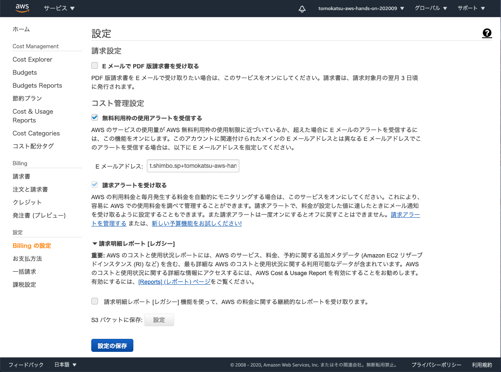
* $0 を超えて費用がかかったときに通知する設定を実施
  * https://console.aws.amazon.com/cloudwatch/home?region=us-east-1#alarmsV2:!namespace=AWS/Billing
  * 下の方の`アラームの作成` ボタンをクリック
    * 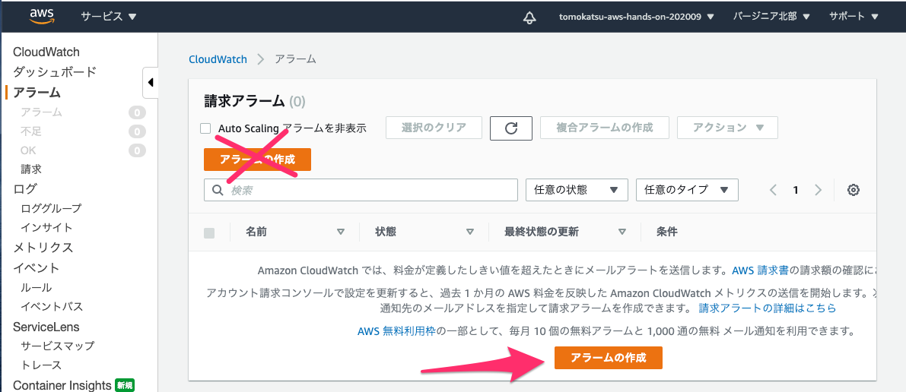
  * `0` USD と入力
    * 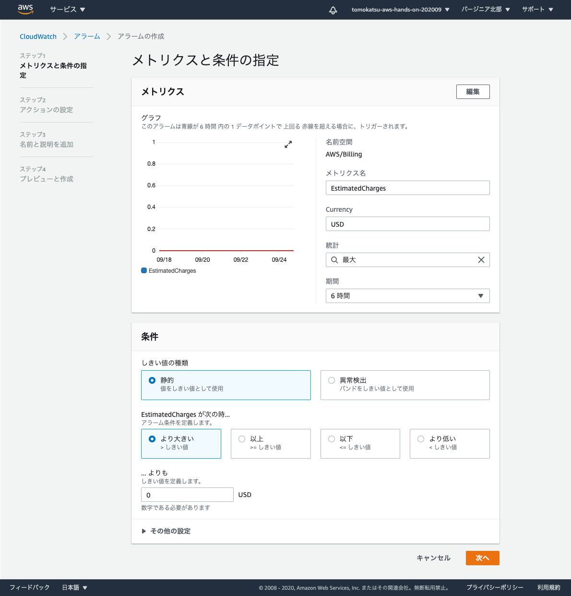
  * `新しいトピックの作成` を選択し、`通知を受け取る E メールエンドポイント` には任意のメールアドレスを記入
    * `トピックの作成`ボタンをクリック
    * 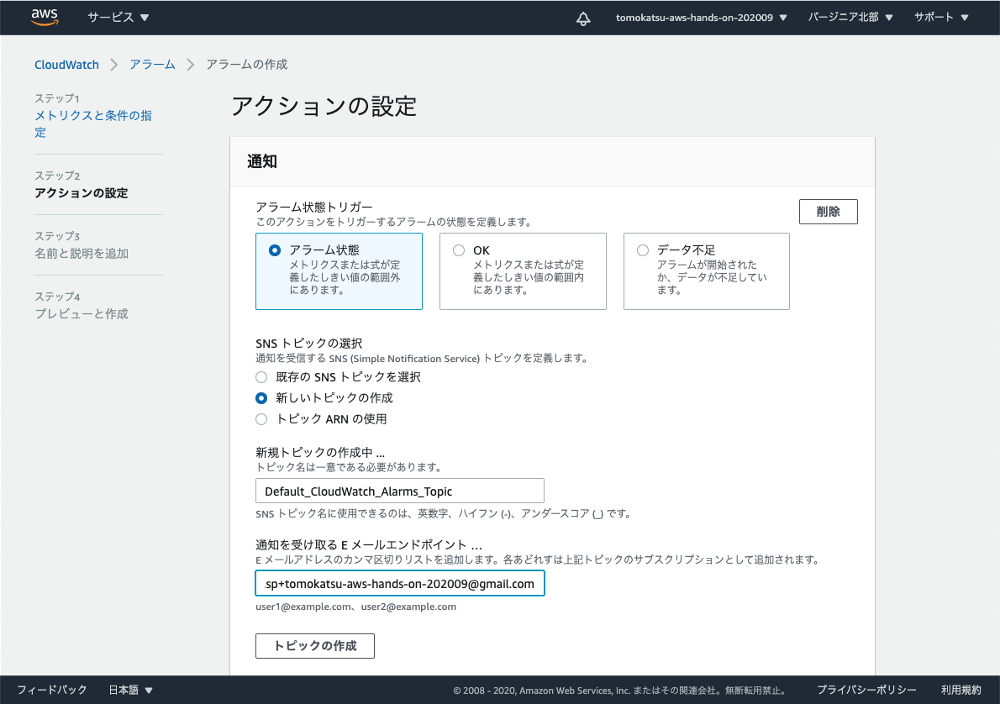
  * `次へ` ボタンをクリック
    * 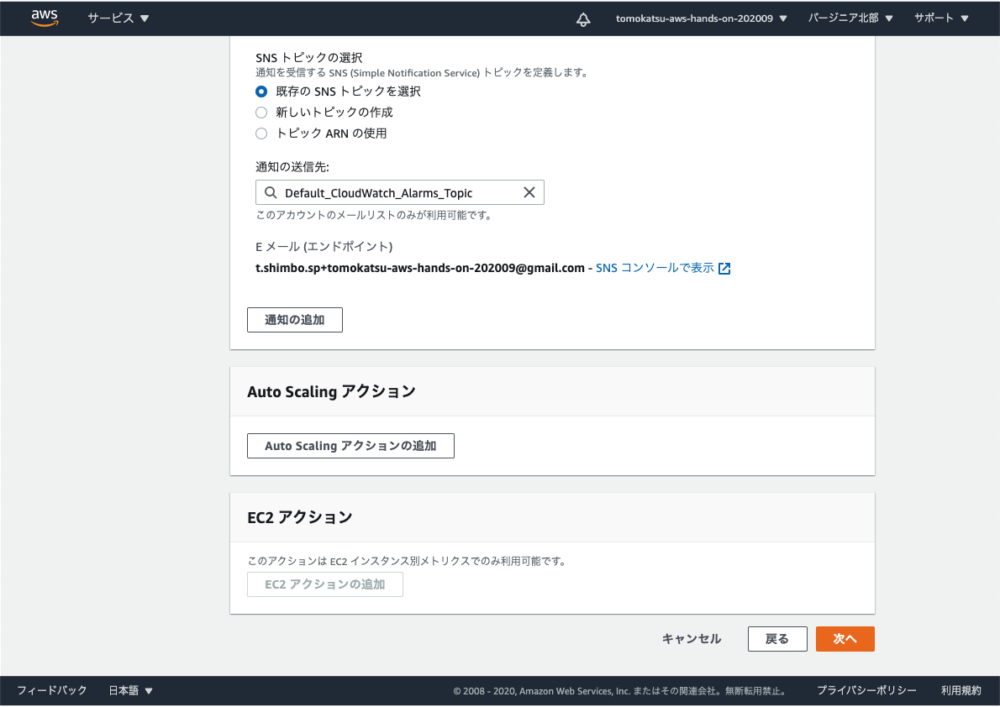
  * アラームの名前を入力し、 `次へ` ボタンをクリック
    * 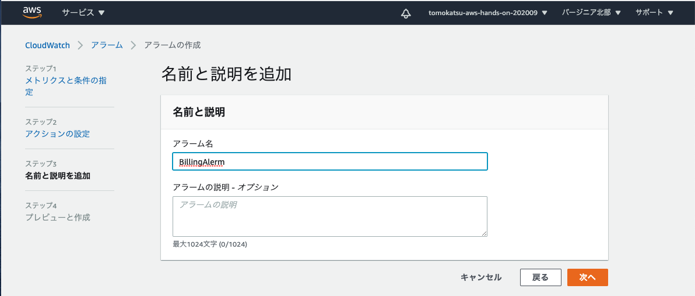
  * `アラームの作成` ボタンをクリック
  * アラームが作成されたら、通知先のメールアドレスに確認メールが飛ぶので、 `Confirm subscription` のリンクをクリックして connfirm させる
    * 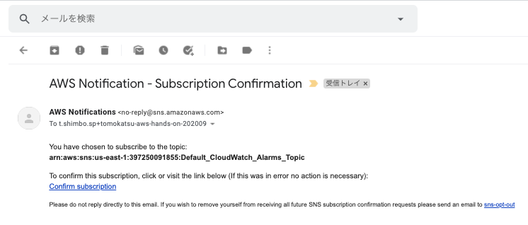
    * 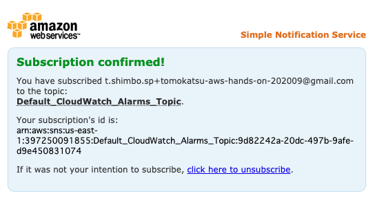
  * 少し時間が経ってうまくいけば、 `データ不足` -> `OK` になるはず
    * 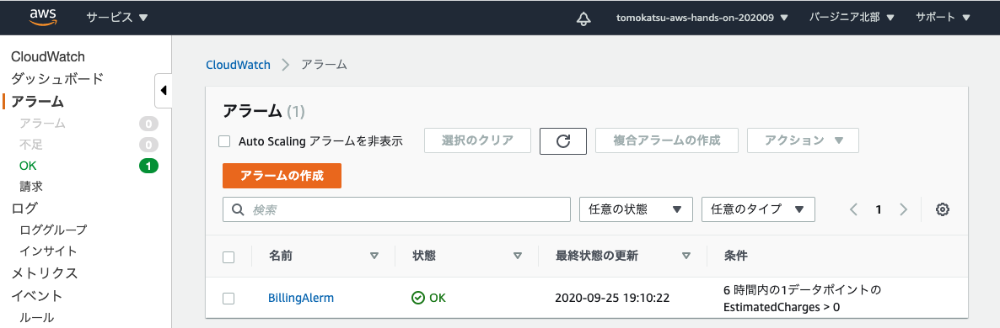

# 以下は、この AWS アカウントを引き続き利用する場合は設定しておくと良い

# ルートアカウントの MFA を有効化
* ルートアカウントにログインする際に、2要素認証が必要になるよう設定する
* https://console.aws.amazon.com/iam/home?region=ap-northeast-1#/home
* `MFAの管理` ボタンをクリック
  * 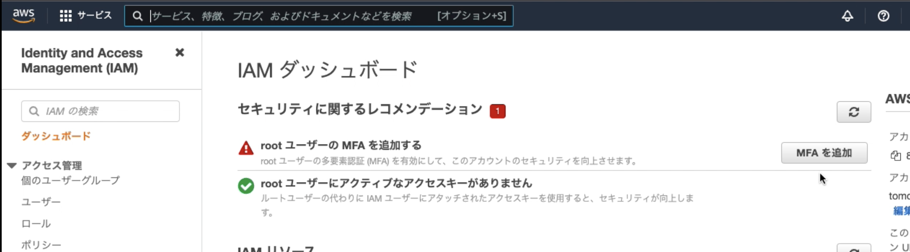
* `MFAの有効化` ボタンをクリック
  * 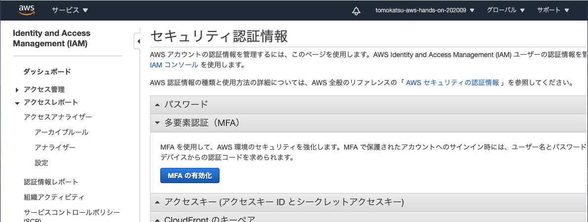
* `仮想 MFA デバイス` を選択し、 `続行` ボタンをクリック
  * 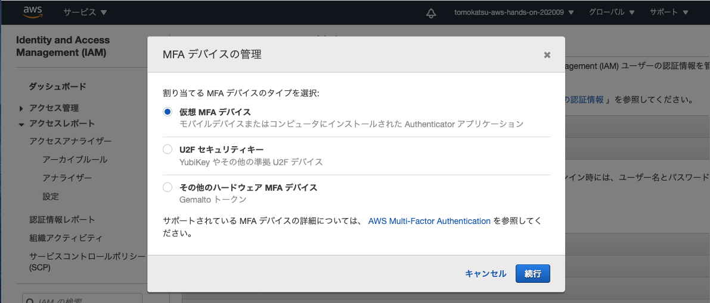
* `QR コードの表示` リンクをクリックし、QR コードを表示させる
  * 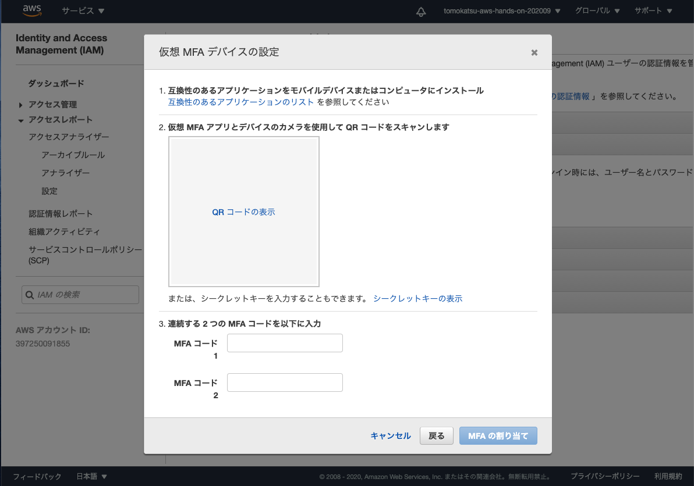
* Authy アプリを起動し、 `Add Account` をタップ
* `Scan QR Code` ボタンをタップし、AWS の画面に表示されている QR コードをスキャンし、名前を決めて保存する
* すると Authy アプリに6桁の数字が表示されるので、まずは `MFA コード1` に入力する
  * 一定時間経って、Authy上で6桁の数字が変化したら、 `MFA コード2` に入力する
  * 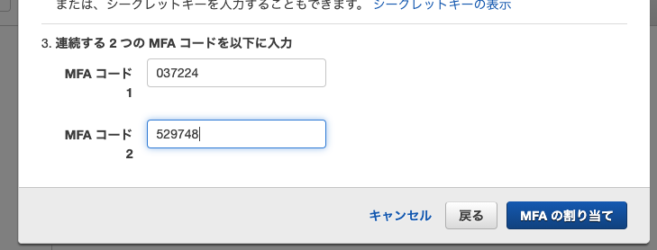
* `MFA の割り当て`ボタンを押して、設定に成功すれば完了
  * 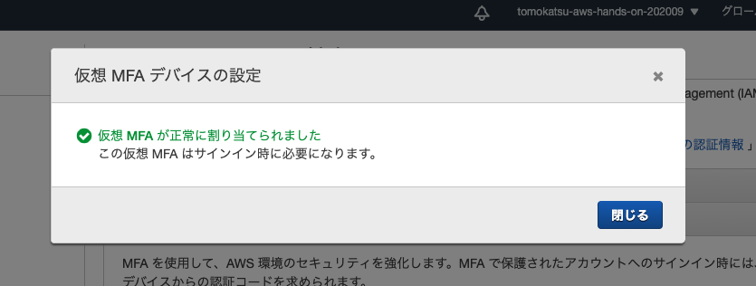
* 一度 AWS アカウントからログアウトして、再度ログインしてみると、MFA コードの入力を求められるはず
  * 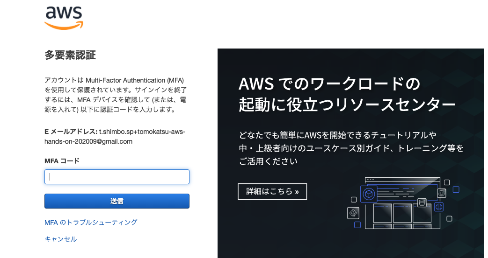

# 利用するリージョンを限定しておく
* AWS にはリージョンという概念がある
  * https://aws.amazon.com/jp/about-aws/global-infrastructure/regions_az/
* リージョンごとに使える機能に若干差がある
  * https://aws.amazon.com/jp/about-aws/global-infrastructure/regional-product-services/
  * 最新機能とかは、米国リージョンが早かったりする
* まずは東京リージョンだけ使えれば十分なので、制限しておく
## 手順
* https://console.aws.amazon.com/iam/home#/account_settings
* エンドポイントの項目にある無効化ボタンを押していく
  * アジアパシフィック（東京）は有効のままで
  * 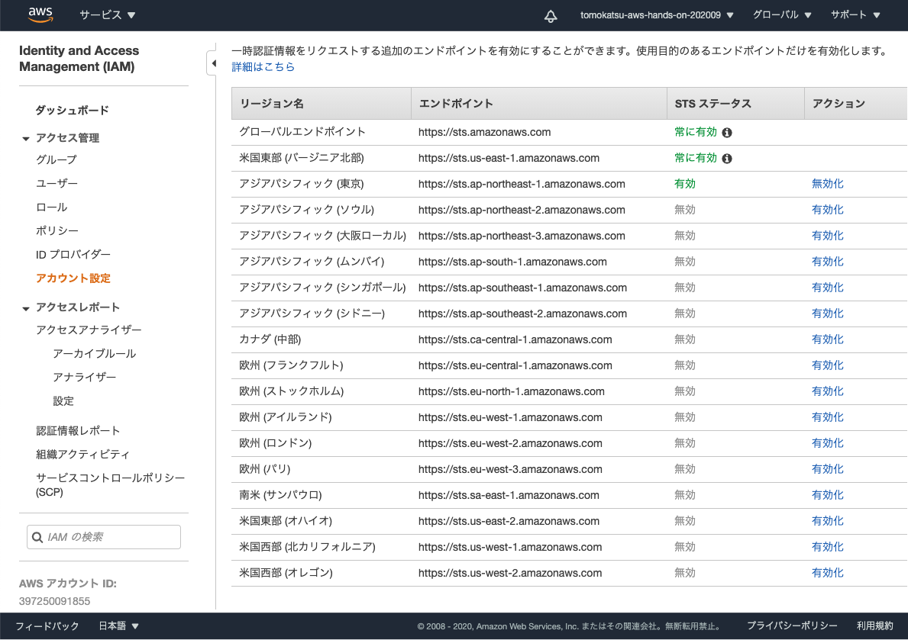

# 裁判所の設定
* AWS利用者とアマゾンとの間に生じる全ての紛争を、日本法に準拠させる契約を有効にしておく
* https://console.aws.amazon.com/artifact/agreements/accounts
* 日本準拠法に関するAWSカスタマーアグリーメント変更契約をチェック
* 契約を受諾ボタンをクリック
* ダウンロードが必要です
  * 契約をダウンロードボタンをクリック
* NDAを受諾して契約をダウンロードする
  * NDA 受諾し、ダウンロードするボタンをクリック
  * ダウンロードした契約書は、都度ダウンロードできるので保存しておく必要はないが、インターネットや第三者には公開しないこと！！
* refs. https://aws.amazon.com/jp/blogs/news/how-to-change-aws-ca-by-artifact/

# その他アカウントの設定
* 下記ページにあるセキュリティーステータスは、本当は全て `Green` になっていることが望ましい
  * https://console.aws.amazon.com/iam/home?region=us-east-1#/home
  * 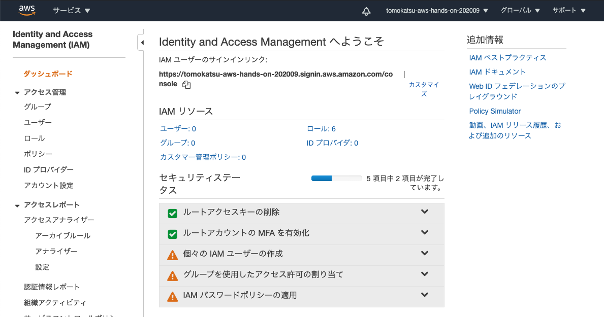

* 良い記事があったので、よければ参考にしてみてください
  * https://qiita.com/tmknom/items/303db2d1d928db720888
  * **CloudTrailの設定をすると`お金がかかるので注意`**
