# Step 3: AWS に EC2 インスタンス（仮想サーバ）を立ち上げてみよう！

# まずは今回作るものの構成について
* AWS の構成図
  * 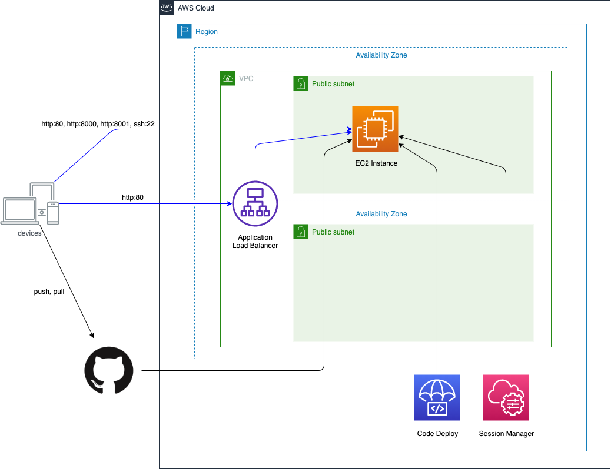
* EC2 の内部構成
  ```
  クライアント or ALB -- <http:8000> -> Nginx -- <http:8001> -> uWSGI(Django)
  ```
  ```
  クライアント -- <http:8001> -> uWSGI(Django)
  ```
  ```
  クライアント -- <http:80> -> Nginx
  ```
  * Nginx は Webサーバの1つで、今回は http リクエストを最初に受けるリバースプロキシとして動きます
  * uWSGI とは、今回 Django のアプリケーションを起動するために利用するアプリケーションサーバです


# EC2 インスタンスを起動しよう
## EC2 とは
* AWS で提供される仮想サーバーを起動、管理するサービス
* 1つ1つの仮想サーバーを EC2 インスタンスと呼ぶ

## EC2 インスタンスに付与する IAM ロールを作成
* EC2 インスタンス内で実行されるアプリケーションに AWS のサービスに対する権限を付与したい
  * 例）EC2 インスタンス内で AWS CLI を利用して S3 からファイルをダウンロードしたい
    * 対象の S3 の閲覧権限を EC2 インスタンスに付与してあげる必要がある
* IAM ロールとは
  * いくつかの権限をセットにしたもの
  * 1つの EC2 インスタンスには 1つの IAM ロールしか付与できないので、その IAM ロールに必要な権限を全て詰め込む

### 実際に作ってみよう
* https://console.aws.amazon.com/iam/home?region=ap-northeast-1#/roles
* `ロールの作成`ボタンをクリック
* `EC2` を選択し`次のステップ:アクセス権限`ボタンをクリック
  * 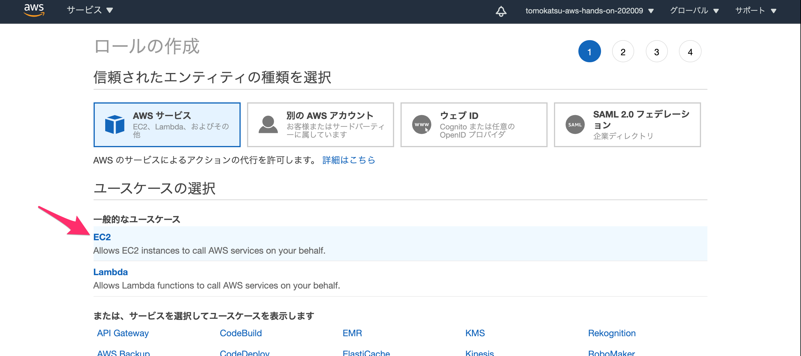
* テキストボックスに `AmazonSSMManagedInstanceCore` と入力し、出てきたポリシーのチェックボックスにチェックを入れ `次のステップ:タグ`ボタンをクリック
  * 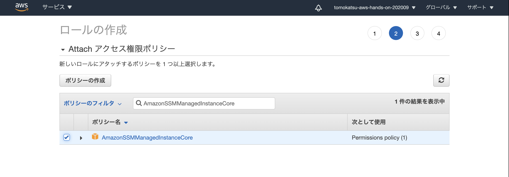
* 特に何もせず`次のステップ:確認`ボタンをクリック
* ロール名のテキストボックスに `aws-hands-on-ec2` と入力し、`ロールの作成` ボタンをクリック
  * 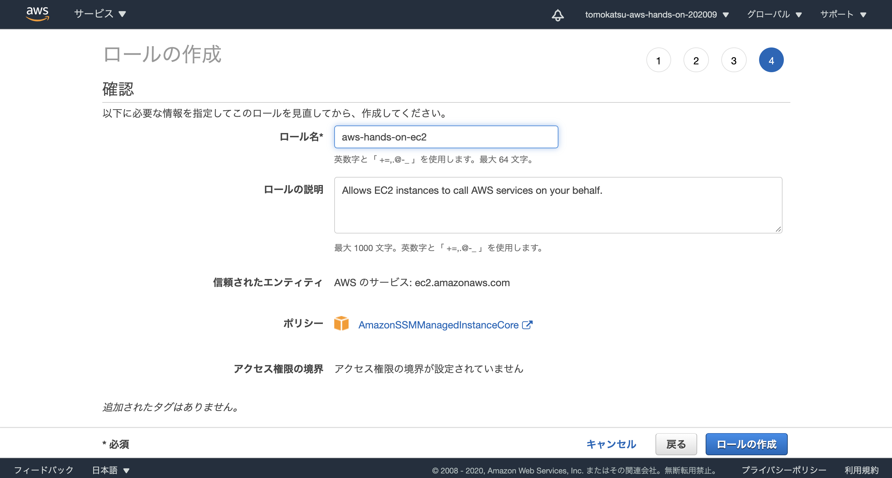
* これで IAM ロールを作成できました

## EC2 インスタンスを起動してみよう
* https://ap-northeast-1.console.aws.amazon.com/ec2/v2/home?region=ap-northeast-1#Instances:
* `インスタンスを起動` ボタンをクリック
* 左の`無料利用枠のみ`にチェックを入れ、`Amazon Linux 2 AMI (HVM) - Kernel 5.10, SSD Volume Type`にある`選択`ボタンをクリック
  * ラジオボタンは `64 ビット (x86)` を選択しておく
  * 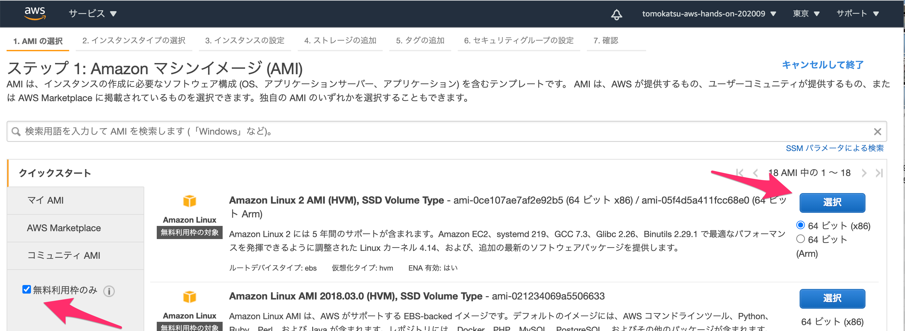
* インスタンスタイプは `t2.micro (無料利用枠の対象)` が選択された状態で`次のステップ: インスタンスの詳細の設定`ボタンをクリック
  * 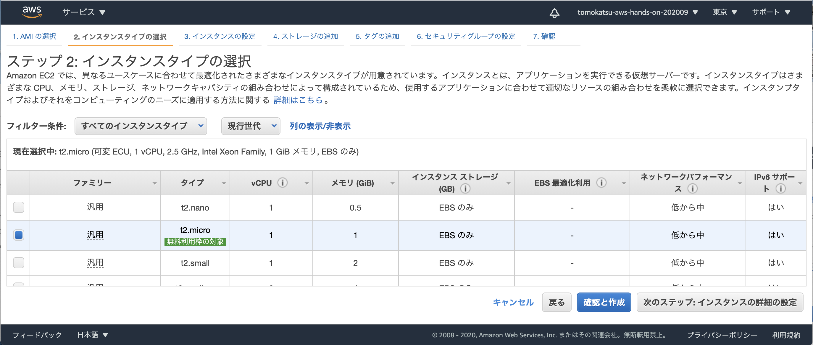
* インスタンスの詳細の設定では2箇所変更する
  * 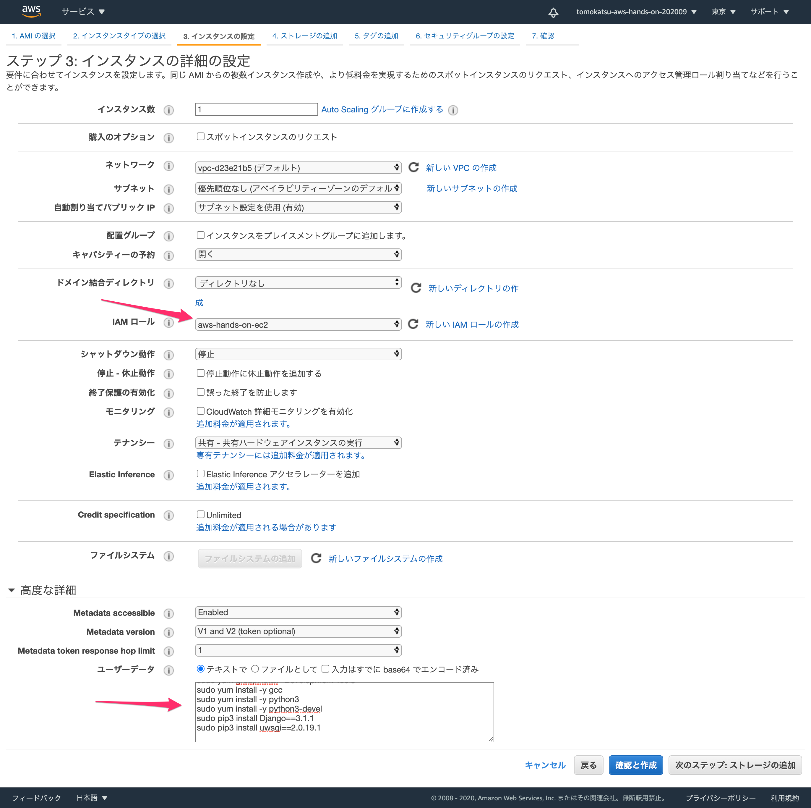
  * 1つめは `IAM ロール` の項目で、先ほど作った `aws-hands-on-ec2` を選択
  * 2つめは `ユーザデータ`の項目で、[../ec2/userdata.sh](../ec2/userdata.sh) の内容をコピー&ペーストする
    * ユーザデータとは、EC2 インスタンスの初回起動時にのみ実行されるスクリプトである
      * 今回は、シェルスクリプトを実行させ、必要なミドルウェアや設定ファイルの作成を行う
  * `次のステップ: ストレージの追加` ボタンをクリック
* ストレージの追加では特に何もせず `次のステップ: タグの追加` ボタンをクリック
* 次に EC2 インスタンスにタグ付けをしておく
  * `タグの追加`ボタンをクリック
  * キーは`CodeDeploy`、値は`aws-hands-on` と入力
    * 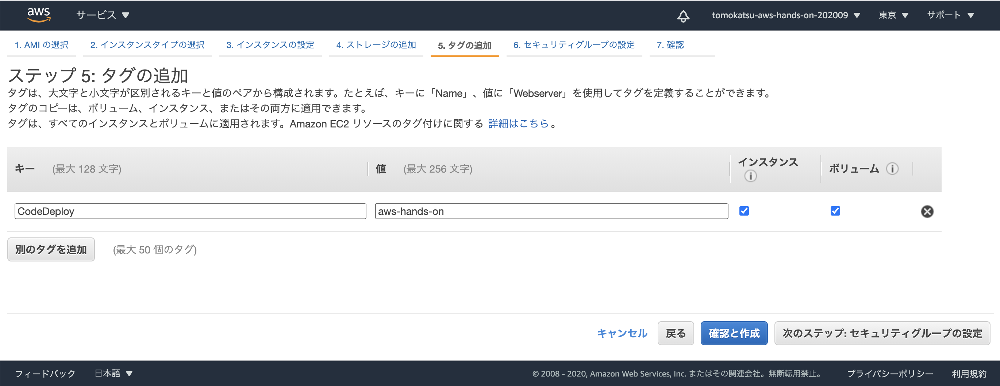
  * `次のステップ: セキュリティグループの設定` ボタンをクリック
* セキュリティーグループの設定は、以下のようにしておく
  * 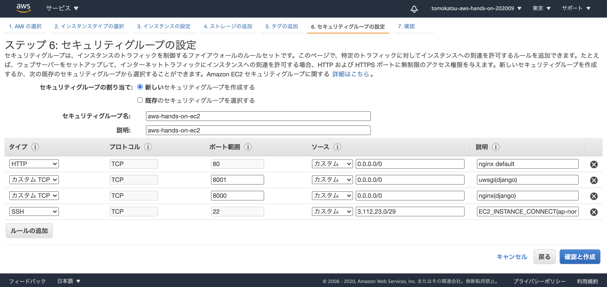
  * 
      |  タイプ        |  プロトコル  | ポート範囲 | ソース           | 説明 |
      | ------------- | ---------- | --------- | -------------- | --- |
      |  HTTP         | TCP        | 80       |カスタム 0.0.0.0/0 | nginx default |
      |  カスタムTCP   | TCP        | 8001     |カスタム 0.0.0.0/0 | uwsgi(django) |
      |  カスタムTCP   | TCP        | 8000     |カスタム 0.0.0.0/0 | nginx(django)    |

  * `確認と作成` ボタンをクリック
* `起動` ボタンをクリック
  * キーペアについて質問されるので `キーペアなしで続行` を選択し、チェックボックスにもチェックを入れる
    * 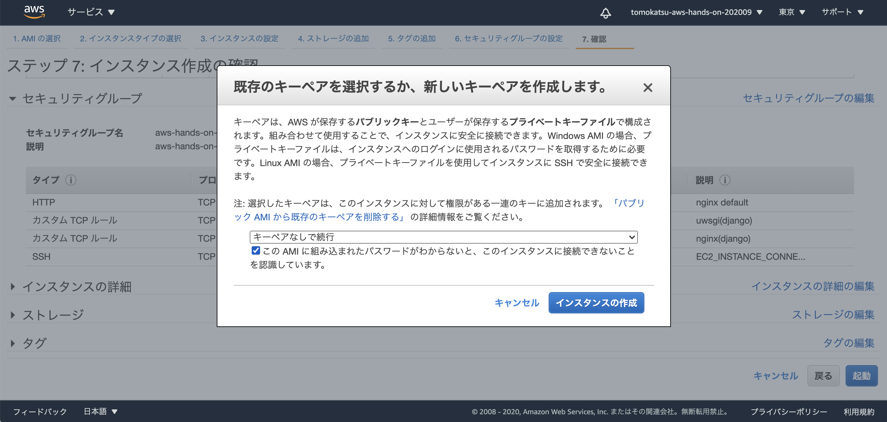
  * `インスタンスの作成`ボタンをクリック
* `インスタンスの表示`ボタンをクリック

# 起動するまでの間に質問タイム
## 起動したかの確認方法
* https://ap-northeast-1.console.aws.amazon.com/ec2/v2/home?region=ap-northeast-1#Instances:
* 対象のインスタンスを選択し、ステータスチェックタブの`システムステータス`と`インスタンスステータス` が両方 `Green` になっていれば無事起動している
  * 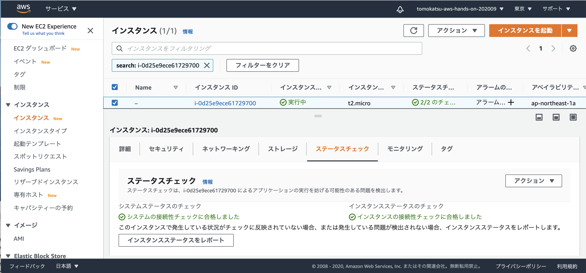

# Web サーバの動作確認
* この時点で EC2 インスタンスの中かでは Nginx が起動しているので、 Web ページを確認することができるはず
* https://ap-northeast-1.console.aws.amazon.com/ec2/v2/home?region=ap-northeast-1#Instances:
* 対象のインスタンスを選択し、詳細タブに記載されている `パブリック IPv4 DNS` をコピー
  * 
* ブラウザの URL 入力欄に貼り付けてアクセスすると、 Nginx の初期ページが見れるはずです
  * 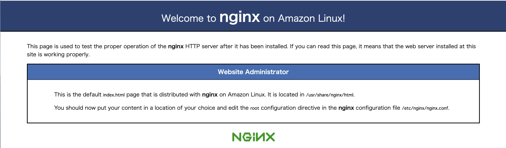

# EC2 インスタンスの中に入ってみよう
* https://ap-northeast-1.console.aws.amazon.com/systems-manager/session-manager/sessions?region=ap-northeast-1
* セッションマネージャーという機能を使って、ssh like に EC2 インスタンスに接続します
* `セッションの開始`ボタンをクリック
* 1つのインスタンスがリストアップされるので、ラジオボタンにチェックを入れて`セッションを開始する`ボタンをクリック
* 無事、以下のような Terminal ぽい画面が表示されれば OK です
  * 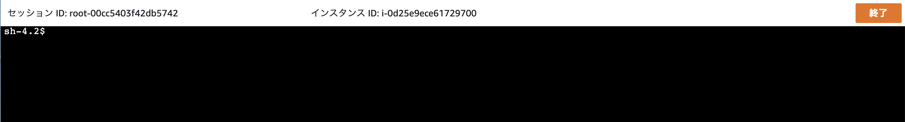
  * シェルを bash とかに変えておくといろいろ便利です
      ```
      sh-4.2$ bash
      [ssm-user@ip-172-31-46-149 bin]$
      ```

# Extra) EC2 インスタンスにインストールされているミドルウェアを見ていこう
* EC2 インスタンスを起動するときに、 `ユーザデータ` というものを設定してもらいました
  * ユーザデータとは、EC2 インスタンスの初回起動時にのみ実行されるスクリプトで、今回はミドルウェアのインストールや設定ファイルの作成をしているというお話をしました
* このユーザデータで何をしていたのかを追いつつ、実際に EC2 インスタンスにログインして確認していきます

## Nginx のセットアップについて
* Nginx がインストールされているかを確認してみる
  ```
  [ssm-user@ip-172-31-22-149 ~]$ yum list installed | grep nginx
  nginx.x86_64                          1:1.18.0-1.amzn2.0.1           @amzn2extra-nginx1
  nginx-all-modules.noarch              1:1.18.0-1.amzn2.0.1           @amzn2extra-nginx1
  nginx-filesystem.noarch               1:1.18.0-1.amzn2.0.1           @amzn2extra-nginx1
  nginx-mod-http-geoip.x86_64           1:1.18.0-1.amzn2.0.1           @amzn2extra-nginx1
  nginx-mod-http-image-filter.x86_64    1:1.18.0-1.amzn2.0.1           @amzn2extra-nginx1
  nginx-mod-http-perl.x86_64            1:1.18.0-1.amzn2.0.1           @amzn2extra-nginx1
  nginx-mod-http-xslt-filter.x86_64     1:1.18.0-1.amzn2.0.1           @amzn2extra-nginx1
  nginx-mod-mail.x86_64                 1:1.18.0-1.amzn2.0.1           @amzn2extra-nginx1
  nginx-mod-stream.x86_64               1:1.18.0-1.amzn2.0.1           @amzn2extra-nginx1
  ```
* Nginx が起動しているかを確認してみる
  ```
  [ssm-user@ip-172-31-22-149 ~]$ systemctl status nginx.service
  ● nginx.service - The nginx HTTP and reverse proxy server
    Loaded: loaded (/usr/lib/systemd/system/nginx.service; enabled; vendor preset: disabled)
    Active: active (running) since Fri 2020-09-25 08:05:59 UTC; 38min ago
  Main PID: 3634 (nginx)
    CGroup: /system.slice/nginx.service
            ├─3634 nginx: master process /usr/sbin/nginx
            └─3635 nginx: worker process
  ```
* Nginx の設定ファイルが作成されているか確認してみる
  * 設定ファイルみると、8000ポートでリクエストを受けて、8001ポートに流していることがわかる
  ```
  [ssm-user@ip-172-31-22-149 ~]$ ll /etc/nginx/conf.d/
  total 4
  -rw-r--r-- 1 root root 1046 Sep 25 08:05 mysite.conf
  [ssm-user@ip-172-31-22-149 ~]$ less /etc/nginx/conf.d/mysite.conf
  ```

## Django と uWSGI のセットアップについて
* python3 がインストールされていることを確認してみてください！
* pip3 で Django と uWSGI がインストールされているかを確認してみる
  ```
  [ssm-user@ip-172-31-22-149 ~]$ pip3 list
  Package    Version
  ---------- --------
  asgiref    3.2.10
  Django     3.1.1
  pip        9.0.3
  pytz       2020.1
  setuptools 38.4.0
  sqlparse   0.3.1
  uWSGI      2.0.19.1
  ```
### uWSGI の起動方法
* いろいろ起動方法があるのですが、今回は Amazon Linux 2 でも採用されている systemd というシステム管理デーモンを活用する
  * さっきから systemctl status nginx とかやってるやつ
* systemd から起動できるように、起動スクリプト（ユニットファイル）をユーザデータで作成していた
  ```
  [ssm-user@ip-172-31-22-149 ~]$ cat /etc/systemd/system/emperor.uwsgi.service
  [Unit]
  Description=uWSGI Emperor
  After=syslog.target

  [Service]
  ExecStart=/usr/local/bin/uwsgi --emperor /etc/uwsgi/vassals
  # Requires systemd version 211 or newer
  RuntimeDirectory=uwsgi
  Restart=always
  KillSignal=SIGQUIT
  Type=notify
  StandardError=syslog
  NotifyAccess=all

  [Install]
  WantedBy=multi-user.target
  ```
* 細かくは追わないが、 `ExecStart` の項目を見てもらうと、uwsgi を emperor モードで起動していることがわかる
* この `emperor.uwsgi.service` の起動状態を確認してみる
  ```
  [ssm-user@ip-172-31-22-149 ~]$ systemctl status emperor.uwsgi.service
  ● emperor.uwsgi.service - uWSGI Emperor
    Loaded: loaded (/etc/systemd/system/emperor.uwsgi.service; enabled; vendor preset: disabled)
    Active: active (running) since Fri 2020-09-25 08:06:57 UTC; 49min ago
  Main PID: 4454 (uwsgi)
    Status: "The Emperor is governing 1 vassals"
    CGroup: /system.slice/emperor.uwsgi.service
            ├─4454 /usr/local/bin/uwsgi --emperor /etc/uwsgi/vassals
            ├─4531 /usr/local/bin/uwsgi --ini mysite.ini
            ├─4532 /usr/local/bin/uwsgi --ini mysite.ini
            └─4533 /usr/local/bin/uwsgi --ini mysite.ini
  ```
* uWSGI の emperor モードは何かというと、個別の uWSGI アプリケーションサーバを管理してくれるモードで、今回起動する uWSGI の設定は別途ある（これもユーザデータで作成済）
  * 実際には、 /etc/uwsgi/vassals 配下にある設定ファイルを読み込んで、起動してくれる
  ```
  [ssm-user@ip-172-31-22-149 ~]$ cat /etc/uwsgi/vassals/mysite.ini
  [uwsgi]
  http = :8001
  chdir = /web/mysite/app
  module = config.wsgi
  touch-reload = /web/mysite/reload.trigger
  ```
  * これをみると 8001ポートで起動していることがわかる
    * つまりnginx から流れてくる http リクエストはここに来る
  * また、Django のソースコードは `/web/mysite/app` に配置することを想定してある

## セッションマネージャーの Agent について
* 今回、EC2インスタンスへのログインはセッションマネージャーを利用しているが、そのためにはセッションマネージャーの Agent を EC2 インスタンス上で起動しておく必要がある
  * Amazon Linxu 2 では初期状態でインストールされていて、自動起動される
  ```
  [ssm-user@ip-172-31-22-149 ~]$ systemctl status amazon-ssm-agent.service
  ● amazon-ssm-agent.service - amazon-ssm-agent
    Loaded: loaded (/usr/lib/systemd/system/amazon-ssm-agent.service; enabled; vendor preset: enabled)
    Active: active (running) since Fri 2020-09-25 08:05:38 UTC; 58min ago
  Main PID: 3240 (amazon-ssm-agen)
    CGroup: /system.slice/amazon-ssm-agent.service
            ├─3240 /usr/bin/amazon-ssm-agent
            ├─3511 /usr/bin/ssm-session-worker root-0568c1f6b82fc800c i-03e25a98b08f4971e
            ├─3547 sh
            ├─3640 bash
            └─4805 systemctl status amazon-ssm-agent.service
  ```
  * これをみると、amazon-ssm-agent.service　のプロセスから sh や bash が起動されてることがわかる
