# Step 4: EC2 インスタンスに Django のアプリケーションをデプロイしてみよう
* 今回は、CodeDeploy というサービスを使ってデプロイをします
* 現状、まだ EC2 インスタンス上に Django のアプリケーションが存在しないことを確認しておこう
  * Step 3 でも記載しましたが、Django のアプケーションは `/web/mysite/app` に配置されることを想定しています
  ```
  [ssm-user@ip-172-31-22-149 bin]$ ll /web
  ls: cannot access /web: No such file or directory
  ```

# 皆さんが思いつく、あるいは実施したことがあるデプロイの方法って何かあります？
* etc ...

# tomokatsu/aws-hands-on リポジトリを fork
* デプロイするアプリケーションもこの `tomokatsu/aws-hands-on` に存在するので、自分の　GitHub アカウントに　fork しましょう
  * 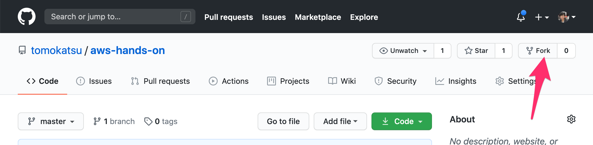

# CodeDeploy 用の IAM ロールを作成
* IAM ロールの画面を表示し、`ロールの作成` ボタンをクリック
  * https://console.aws.amazon.com/iam/home?region=ap-northeast-1#/roles
* 2箇所で `CodeDeploy` を選択する
  * 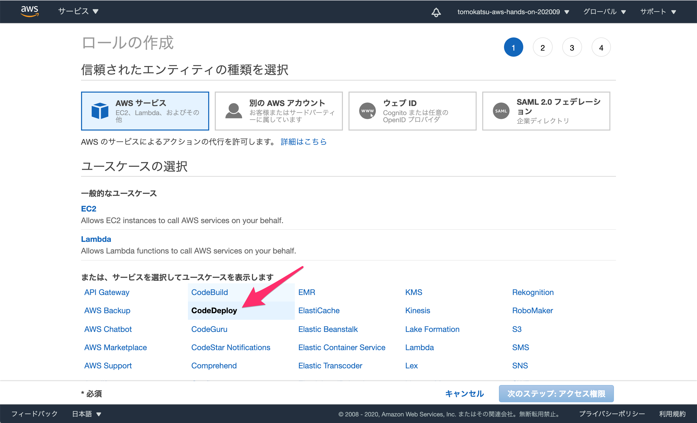
  * 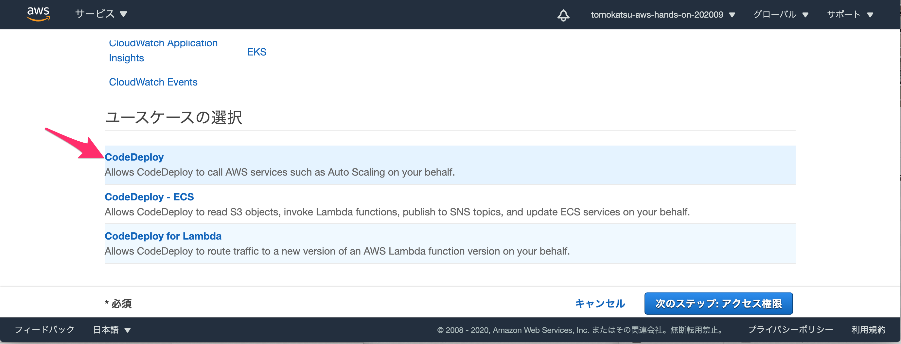
* `次のステップ: アクセス権限` ボタンをクリック
* `AWSCodeDeployRole` をテキストボックスに入力して検索し、 `次のステップ: タグ` ボタンをクリック
  * 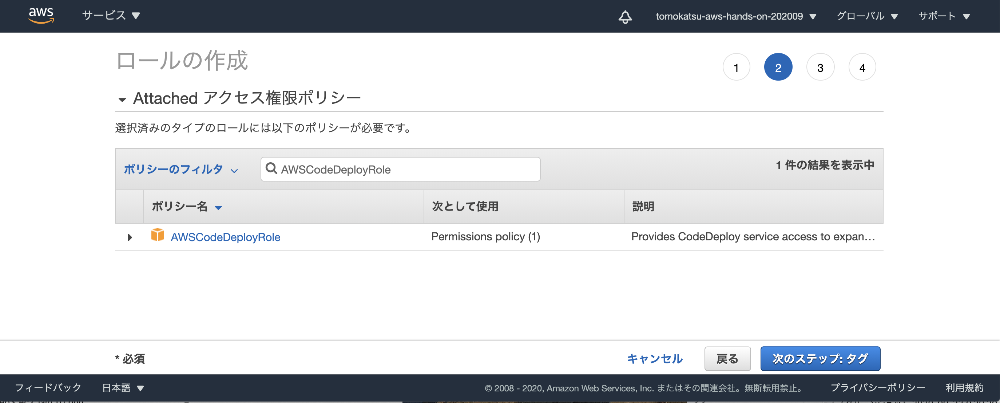
* タグの設定は不要なので、`次のステップ: 確認` ボタンをクリック
* `aws-hands-on-codedeploy` という名前を記載し、`ロールの作成` ボタンをクリック
  * 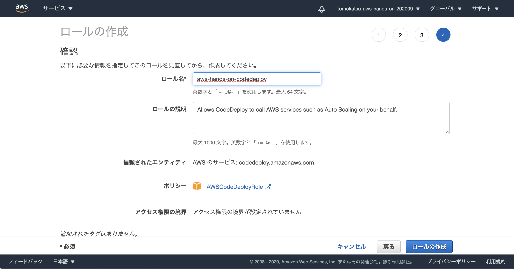

# CodeDeploy の設定
* CodeDeploy の画面にアクセス
  * https://ap-northeast-1.console.aws.amazon.com/codesuite/codedeploy/start?region=ap-northeast-1
  * `アプリケーションの作成`ボタンをクリック
* アプリケーション名、コンピューティングプラットフォームを入力し、`アプリケーションの作成`ボタンをクリック
  * 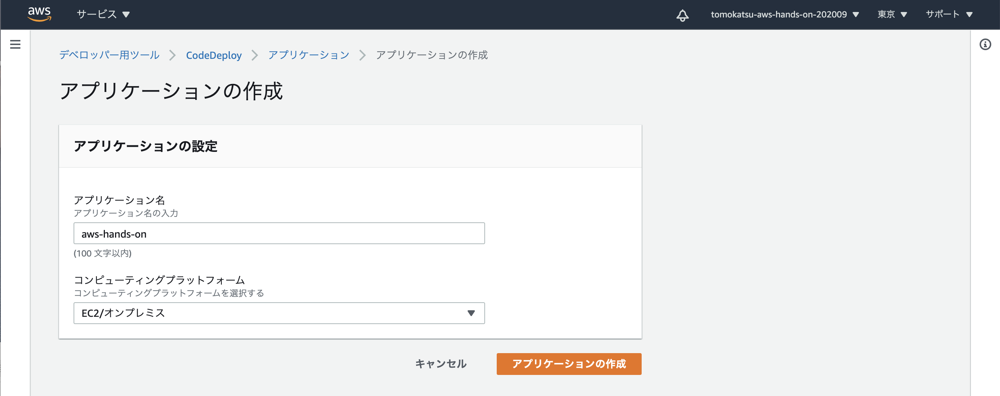
* リダイレクトされた画面にある`デプロイグループの作成`ボタンをクリック
  * 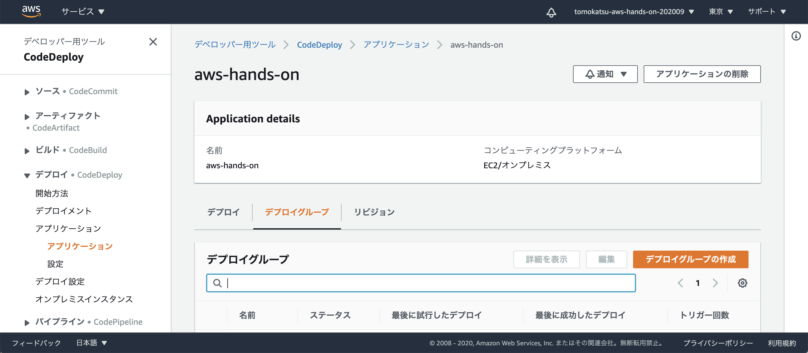
* デプロイグループの作成では、まずデプロイグループ名に `aws-hands-on` を入力
* 次に、サービスロールを設定する
  * 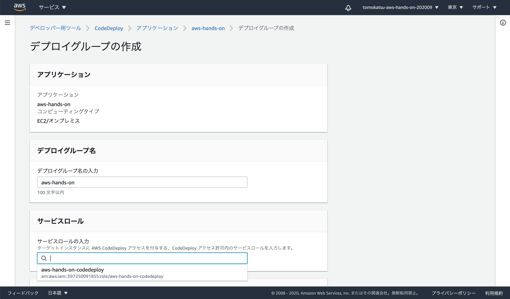
  * 前の手順で作成した `aws-hands-on-codedeploy` 
  が選択できるはず
* 環境設定の項目では `Amazon EC2 インスタンス` をチェック
  * タググループには以下を入力する
    * キー: CodeDeploy
    * 値: aws-hands-on
  * 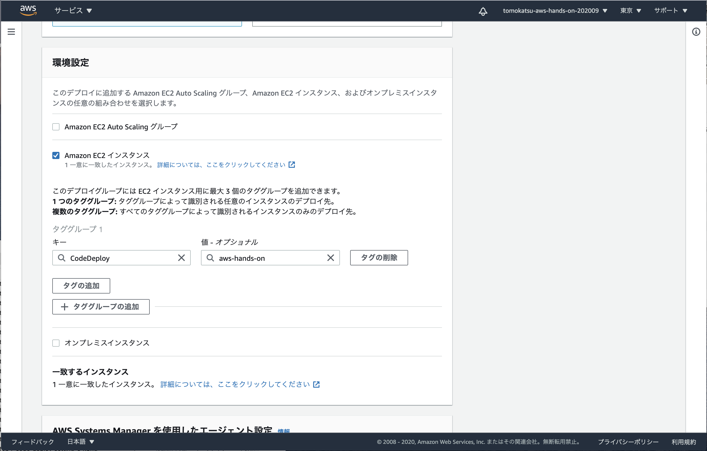
* Load Balancer の項目では、チェックを外す
  * 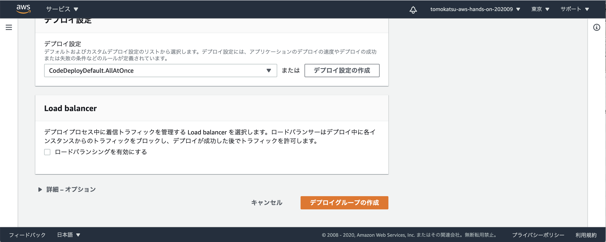

* `デプロイグループの作成` ボタンを押す

# CodeDeploy で Django アプリケーションをデプロイ
* CodeDeploy の画面を表示
  * https://ap-northeast-1.console.aws.amazon.com/codesuite/codedeploy/applications/aws-hands-on/deployment-groups/aws-hands-on?region=ap-northeast-1
  * 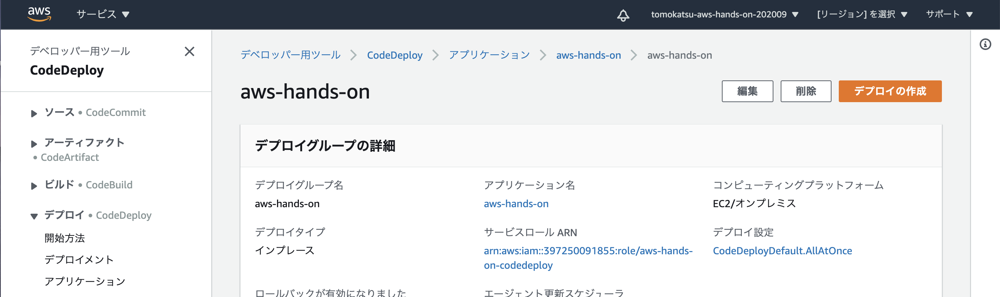
* `デプロイの作成` ボタンをクリック
* `リビジョンタイプ` は `アプリケーションはGitHubに格納されています` をチェック
  * `Github トークン名` は、あなたの GitHub ユーザネームを入力
    * `tomokatsu` ではないので**注意！！！**
  * `GitHubに接続` ボタンをクリックし、Authorize する
  * `リポジトリ名`は、デプロイするリポジトリの名前を設定
    * 今回は、各自の GitHub ユーザに fork した aws-hands-on リポジトリを指定
  * `コミットID` は、デプロイしたいコミットの ID を指定
  * 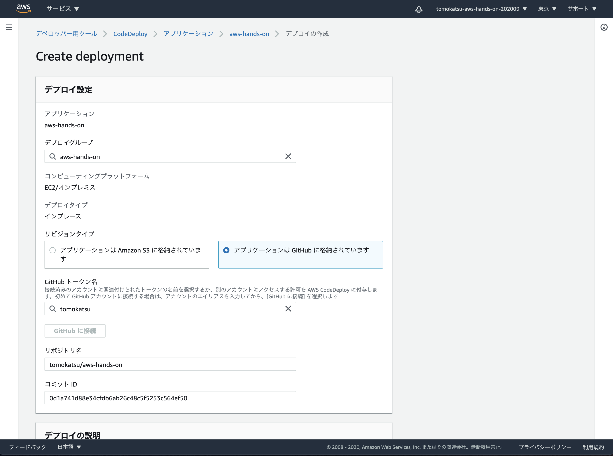
* `デプロイの作成` ボタンをクリックし、デプロイを開始する！
* 成功となったら、無事デプロイできているはず
  * 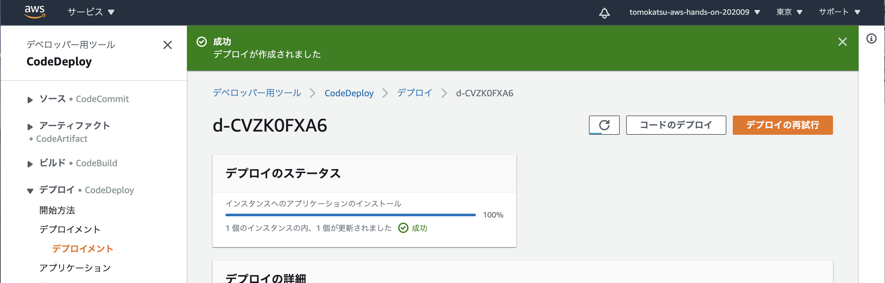
* 実際に、 EC2 インスタンス上にファイルが作成されているかを確認してみましょう
  ```
  [ssm-user@ip-172-31-22-149 bin]$ ll /web/mysite/
  total 0
  drwxr-xr-x 3 root root 37 Sep 25 08:17 app
  -rw-r--r-- 1 root root  0 Sep 25 08:17 reload.trigger
  ```

# 動作確認
* https://ap-northeast-1.console.aws.amazon.com/ec2/v2/home?region=ap-northeast-1#Instances:
* 対象のインスタンスを選択し、詳細タブに記載されている `パブリック IPv4 DNS` をコピー
  * 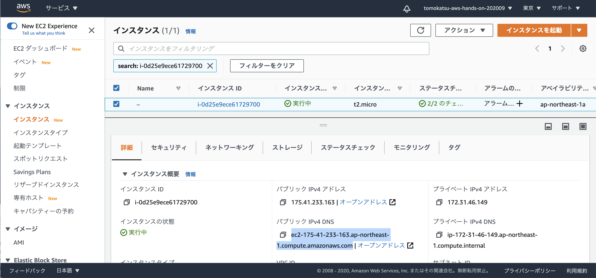
* ブラウザのアドレスバーには、コピーしたURLにポート番号をつけてアクセスする
  * Nginx 経由
    * http://<パブリック IPv4 DNS>:8000/
  * uWSGI 直
    * http://<パブリック IPv4 DNS>:8001/

# 想定したディレクトリにデプロイされた理由
* ここまでの設定で、 `/web/mysite/app` にデプロイするような指示はしていませんでした
* 実は、GitHub リポジトリの [../appspec.yml](../appspec.yml) に CodeDeploy に対する指示が記載してあります
* appspec.yml で指示している内容は以下
  * リポジトリの `docker/app` ディレクトリを `/web/mysite/app` に配置
  * 配置した後、 [../codedeploy/after_install.sh](../codedeploy/after_install.sh) を実行
    * after_install.sh で `touch /web/mysite/reload.trigger` しなければ、ディレクトリに配置しても最新のアプリケーションに切り替わらない
    * [../ec2/server/etc/uwsgi/vassals/mysite.ini](../ec2/server/etc/uwsgi/vassals/mysite.ini) に `touch-reload` オプションを指定しているから touch で reload できる

# Extra) Github Actions から CodeDeploy を実行する
* CodeDeploy でデプロイを作成するの、実際手間かかりましたよね？
  * リポジトリ名入れたり、コミットID入れたり
* ここでは、GithubActions と連携し、 master ブランチに変更が取り込まれたタイミングでデプロイが動くようにしていきます

## IAM ユーザの作成
* `ユーザの追加`　ボタンをクリック
  * https://console.aws.amazon.com/iam/home?region=ap-northeast-1#/users
  * 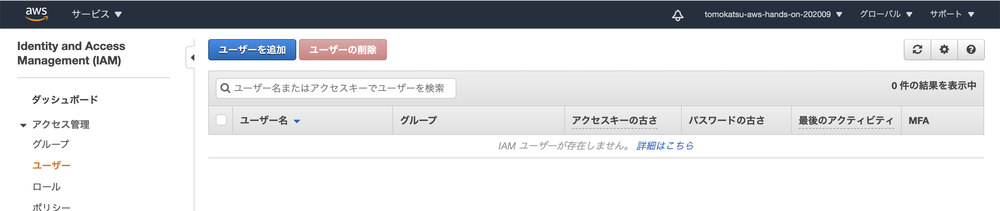
* ユーザ名に `aws-hands-on-github-actions` と入力
  * 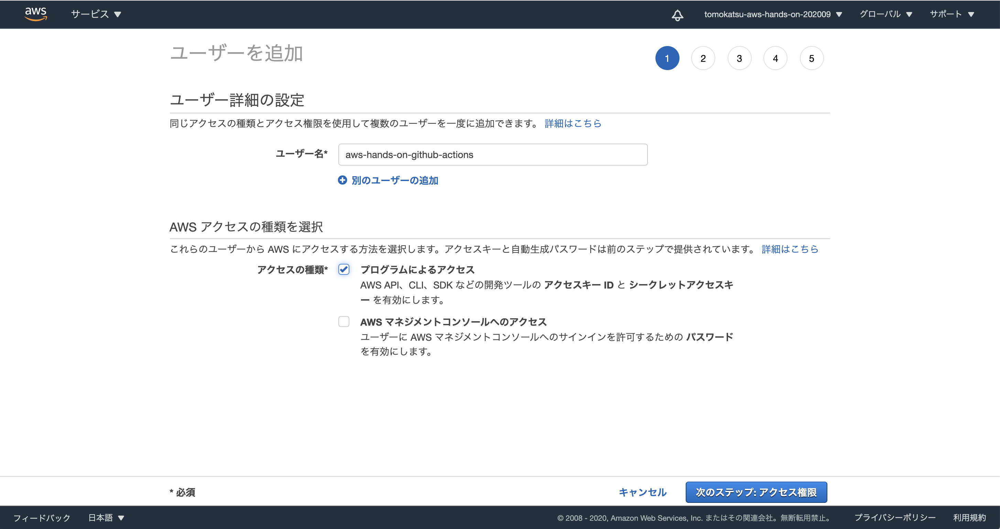
  * `プログラムによるアクセス` にチェックを入れて、`次のステップ: アクセス権限` ボタンをクリック
* `AWSCodeDeployFullAccess` を検索し、選択して `次のステップ: タグ` ボタンをクリック
  * 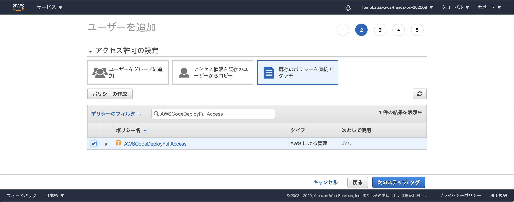
* タグの追加は特に設定せず、 `次のステップ: 確認` ボタンをクリック
  * 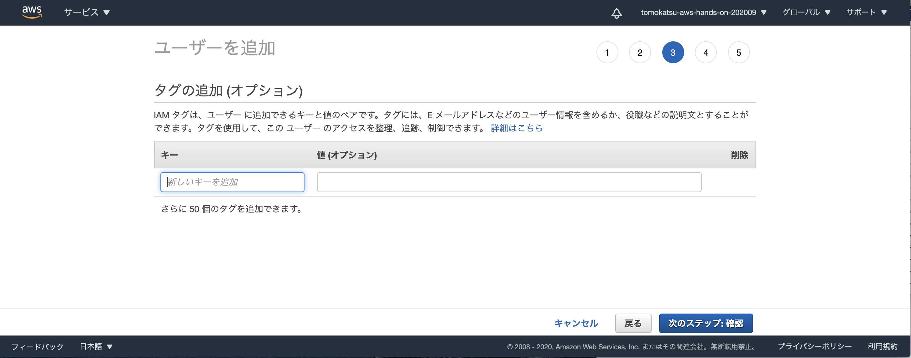
* 内容を確認し`ユーザの作成`ボタンをクリック
  * 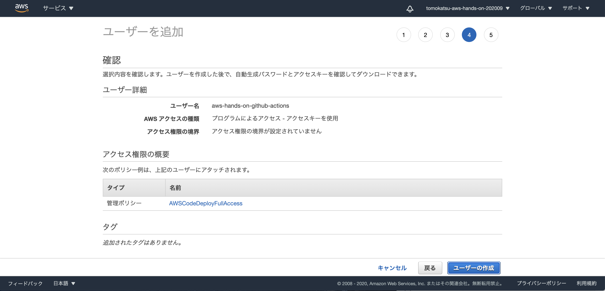
* `.csv のダウンロード` ボタンをクリックし、クレデンシャルをダウンロードしておく
  * 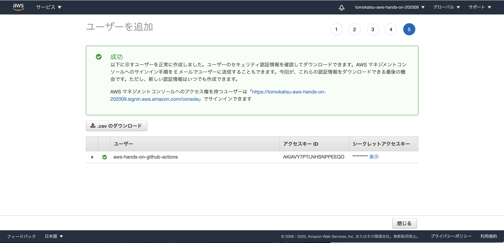

## GitHub のリポジトリに、クレデンシャルを登録
* `New Secret` ボタンをクリック
  * https://github.com/tomokatsu/aws-hands-on/settings/secrets
* 2回に分けて値を登録する
  * 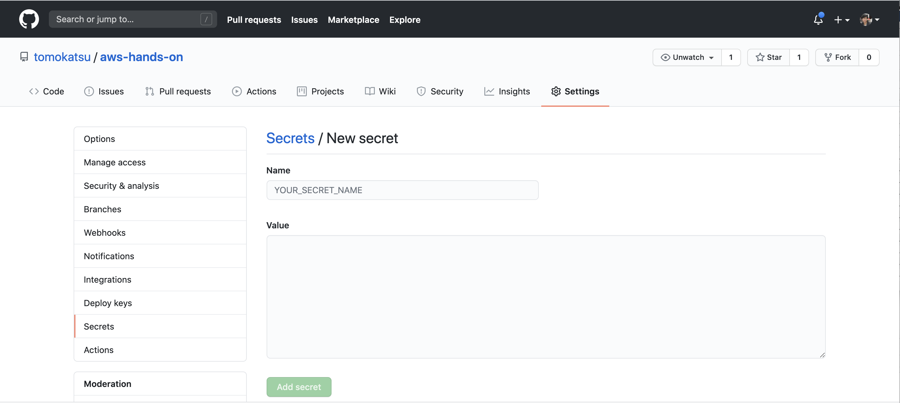
* 登録する値は以下
  * | Name                  | Value      |
    | --------------------- | ---------- |
    | AWS_ACCESS_KEY_ID	    | <CSVを参照> |
    | AWS_SECRET_ACCESS_KEY | <CSVを参照> |
  * 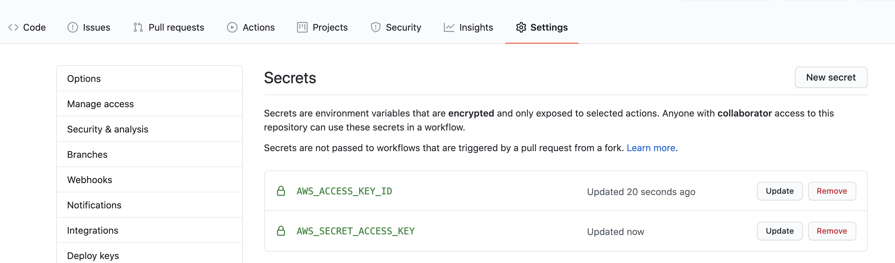

## あとは　master ブランチに変更を加えてみると、 Github Actions が起動するはず
* 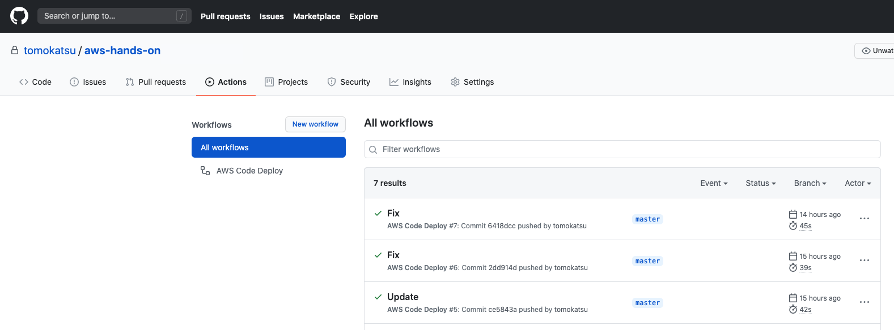

# Extra) Django アプケーションに変更を加えてみる
* では、デプロイできる環境も揃ったので、手元のマシンで Django アプリケーションに変更を加えてみましょう
* 加えた変更は GitHub に push して、再度 CodeDeploy でデプロイしてみましょう
* refs. https://docs.djangoproject.com/ja/3.1/intro/tutorial01/#creating-the-polls-app
