# Step 5: ロードバランサーを利用してみよう
* 今は直接 EC2 インスタンスで http リクエストを受けているが、前段にアプリケーションロードバランサーを設置する
* アプリケーションロードバランサーとは
  * https://docs.aws.amazon.com/ja_jp/elasticloadbalancing/latest/application/introduction.html

# アプリケーションロードバランサーと EC2 インスタンスの構成
```
クライアント -- <http:80> -> アプリケーションロードバランサー(HTTP:80 リスナー)
 -> ターゲットグループ -- <http:8000> ->　EC2 インスタンス
```

# ロードバランサーの作成
* `ロードバランサーの作成` ボタンをクリック
  * https://ap-northeast-1.console.aws.amazon.com/ec2/v2/home?region=ap-northeast-1#LoadBalancers:sort=loadBalancerName
  * 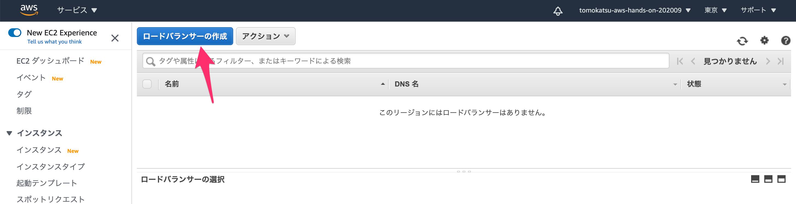
* `Application Load Balancer` の `Create` ボタンをクリック
  * 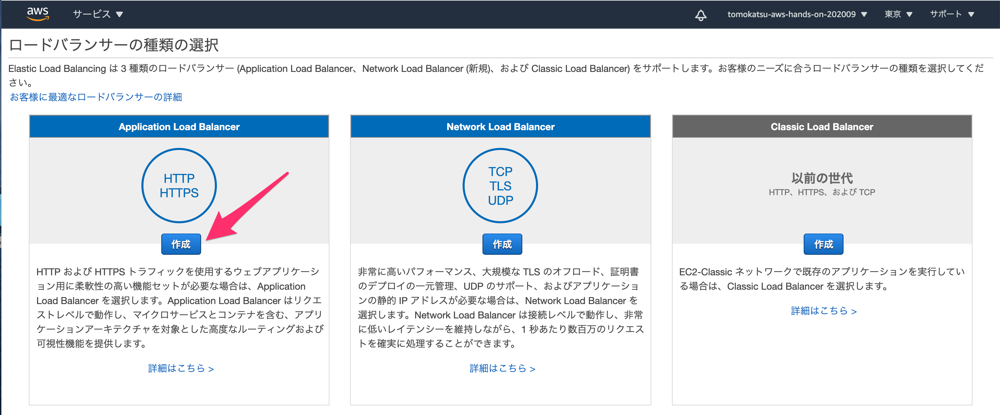
* `Load balancer name` に `aws-hands-on` と入力する
  * 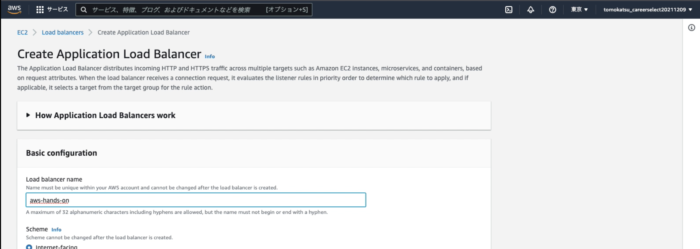
* `Network mapping` の `Mapping` では全て（3つ）のチェックボックスにチェックする 
  * 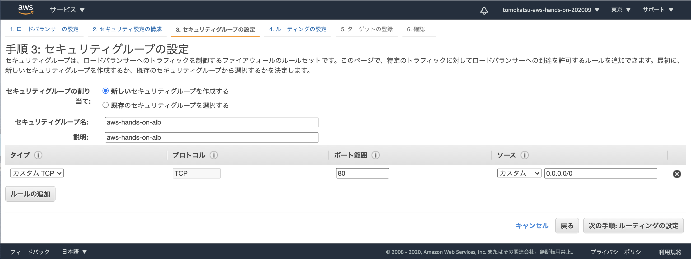
* `Security groups` の項目で、`Create new security group` リンクをクリックする
  * 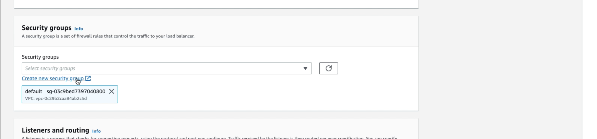
  * 別タブが開くはず
* セキュリティグループを作成する
  * 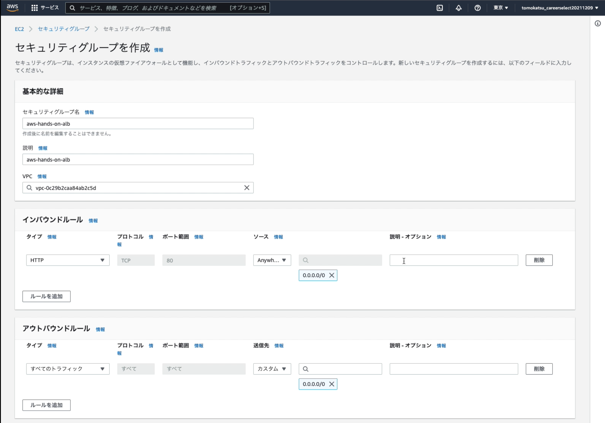

    * セキュリティグループ名: `aws-hands-on`
    * 説明: `aws-hands-on`
    * インバウンドルール
        |  タイプ        |  プロトコル  | ポート範囲 | ソース           | 説明 |
        | ------------- | ---------- | --------- | -------------- | --- |
        |  HTTP         | TCP        | 80       |カスタム 0.0.0.0/0 |　 |
  * `セキュリティグループを作成` ボタンを押す
* 元のタブに戻って、作成したセキュリティグループを選択する
  * 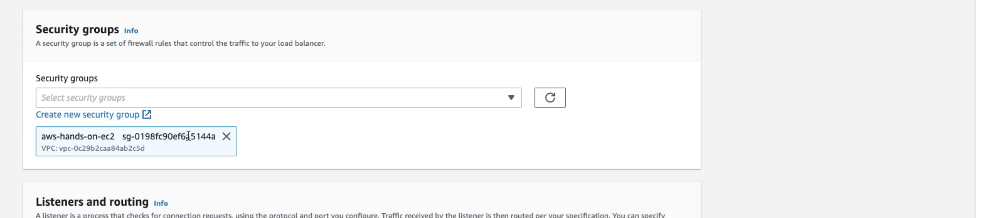

  * `default` のセキュリティグループは使用しないので `×` を押して削除しておく
* `Listeners and routing` の項目で `Create target group` リンクをクリックする
  * 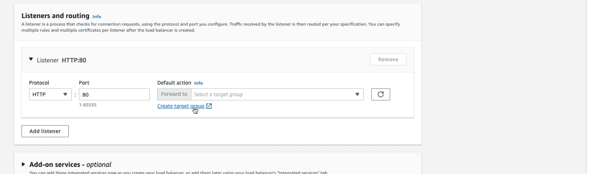
  * 別タブが開くはず
* ターゲットグループを作成する
  * 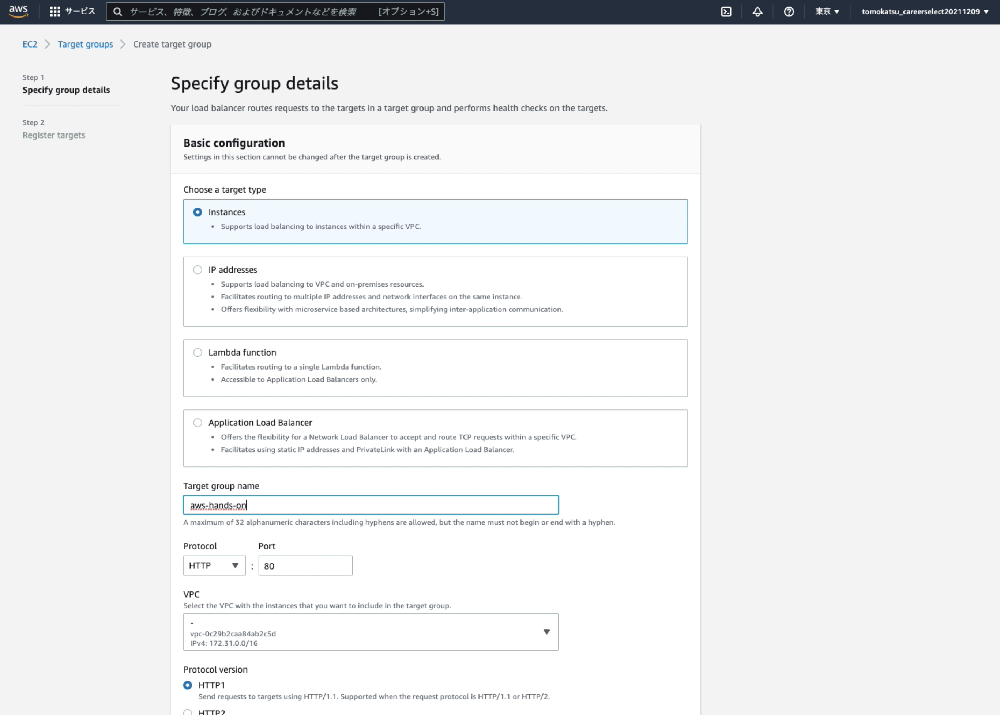

    * Choose a target type: Instances（デフォルト）
    * Target group name: `aws-hands-on`
    * Protocol: HTTP（デフォルト）
    * Port: 80（デフォルト）
  * 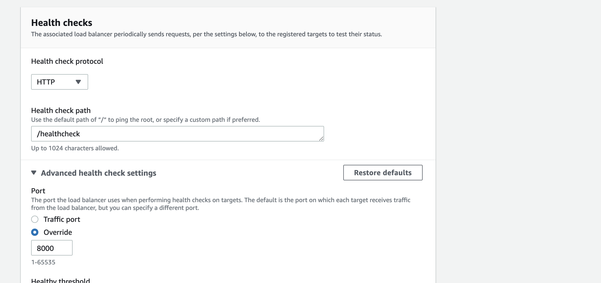

    * Health check protocol: HTTP（デフォルト）
    * Health check path: `/healthcheck`
    * Port: `Override`, `8000`
  * `Next` ボタンを押す
  * EC2インスタンスをターゲットグループに登録する
  * 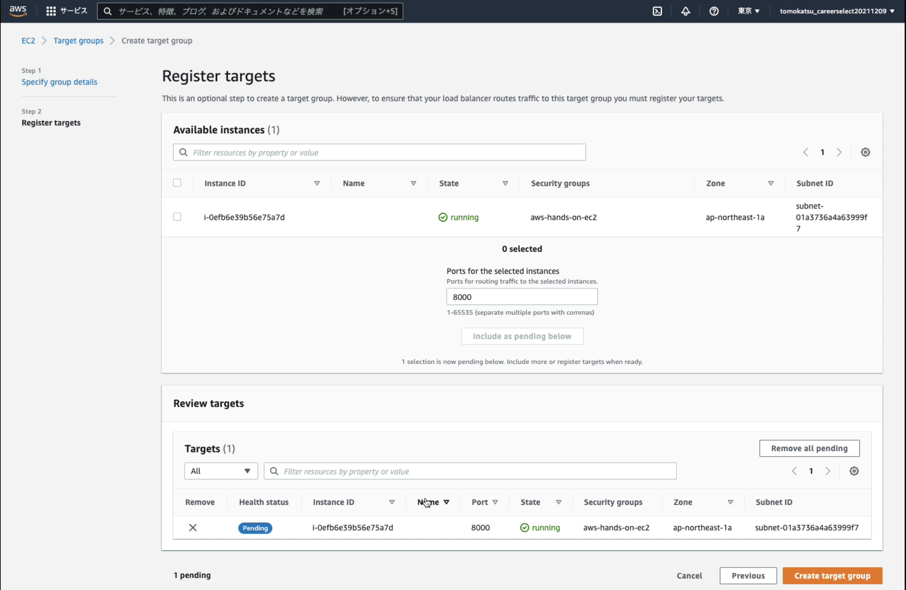
  
    * チェックボックスをチェックし `Includes as pending bellow` ボタンを押す
    * `Create target group` ボタンを押す
* 元のタブに戻って、作成したターゲットグループを選択する
  * 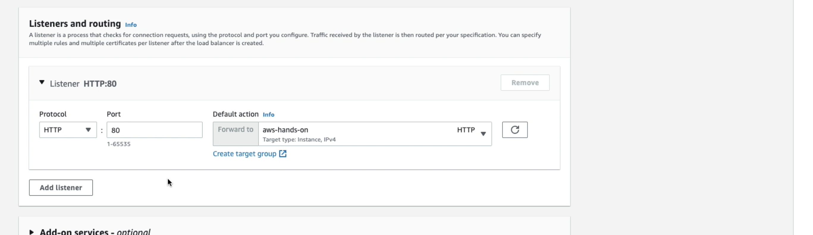
* `Create load balancer` ボタンを押す
* `View load balancer` ボタンを押す

# ターゲットグループの確認
* `aws-hands-on` のターゲットグループをクリック
  * https://ap-northeast-1.console.aws.amazon.com/ec2/home?region=ap-northeast-1#TargetGroups:
* ターゲットグループには EC2 インスタンスを所属させるが、所属している EC2 インスタンスが健康な状態か（healty）かどうかをチェックしている
  * 健康状態は、httpリクエストに対してレスポンスを返しているかという観点で観測している
* ターゲット（EC2 インスタンス）が健康である場合、 `healty` と判断され、ロードバランサにきたリクエストがそのターゲットに流れるようになる
  * 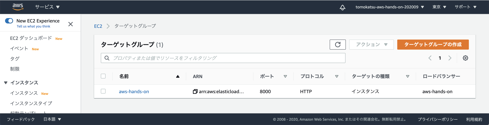

# ロードバランサーの確認
* リスナータブでは、80番ポートに来たHTTPプロトコルのリクエストを、どういうルールでターゲットに流すかという設定がされている
  * https://ap-northeast-1.console.aws.amazon.com/ec2/home?region=ap-northeast-1#LoadBalancers:sort=loadBalancerName
  * `ルール`の項目にある `転送先`（aws-hands-on） はターゲットグループ
  * 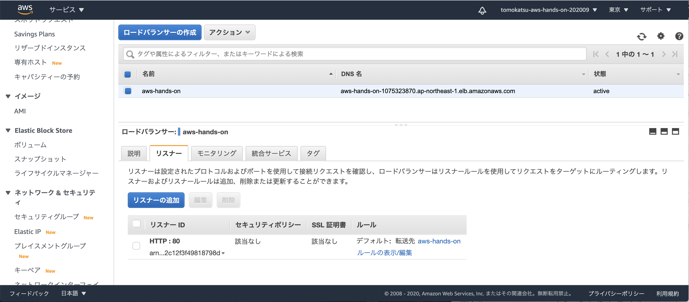
* 説明タブにある `DNS名` を使って、ブラウザからアクセスしてみると、Django のページが見れるはず
  * 

# EC2 インスタンスのセキュリティーグループを制限しよう
* ロードバランサからアクセスできるようになったので、EC2 インスタンスに直接アクセスする必要はありません
* 不用意にポートを開けておくのはセキュリティーリスクにもつながるので、適切に制限しましょう
* `aws-hands-on-ec2` のセキュリティーグループを選択
  * https://ap-northeast-1.console.aws.amazon.com/ec2/home?region=ap-northeast-1#SecurityGroups:
  * 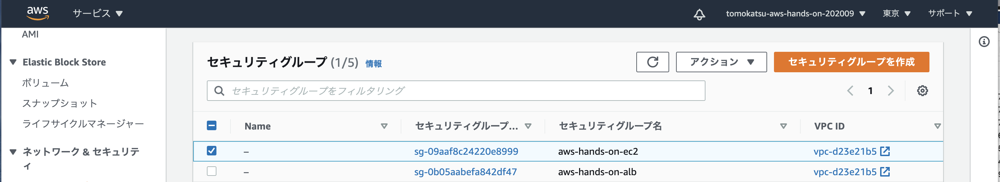
* `インバウンドルールを編集` ボタンをクリック
  * 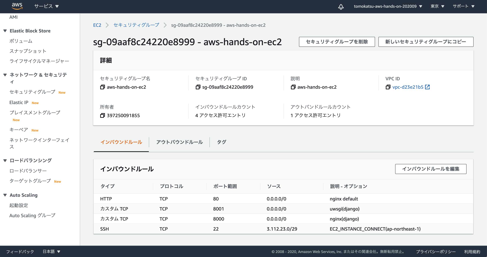
* `インバウンドルール` を以下のように設定
  * 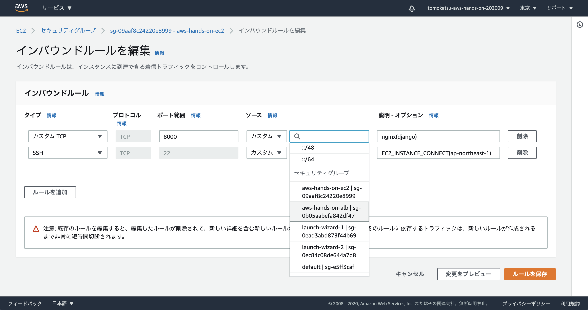
  * `8000` ポートに届くリクエストのソースに `アプリケーションロードバランサーのセキュリティーグループ（aws-hands-on-alb）`を選択
  * `ルールの保存` ボタンをクリック
* 保存されたインバウンドルールはこのようになるはず
  * 
* これでアプリケーションロードバランサーへの 80 番ポートに対するリクエストのみが EC2 インスタンスに到達するようになった
