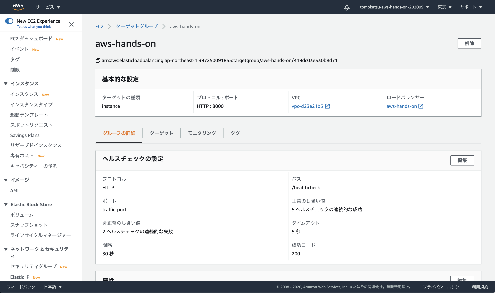
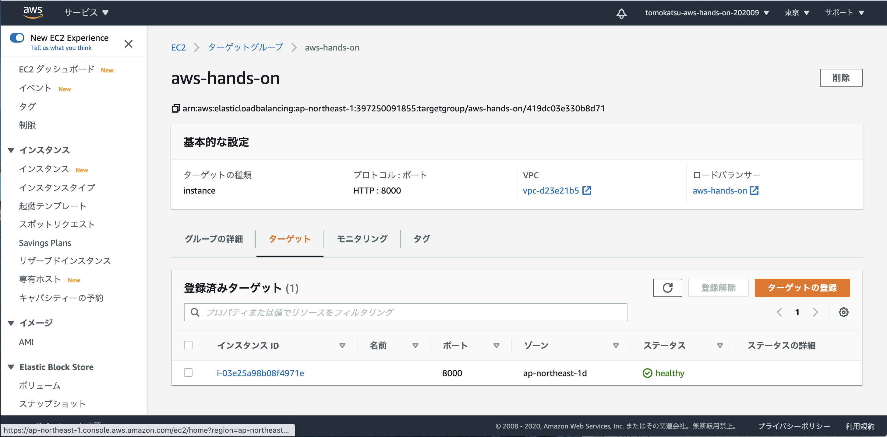

# Step 5: ロードバランサーを利用してみよう
* 今は直接 EC2 インスタンスで http リクエストを受けているが、前段にアプリケーションロードバランサーを設置する
* アプリケーションロードバランサーとは
  * https://docs.aws.amazon.com/ja_jp/elasticloadbalancing/latest/application/introduction.html

# アプリケーションロードバランサーと EC2 インスタンスの構成
```
クライアント -- <http:80> -> アプリケーションロードバランサー(HTTP:80 リスナー)
 -> ターゲットグループ -- <http:8000> ->　EC2 インスタンス
```

# ロードバランサーの作成
* `ロードバランサーの作成` ボタンをクリック
  * https://ap-northeast-1.console.aws.amazon.com/ec2/v2/home?region=ap-northeast-1#LoadBalancers:sort=loadBalancerName
  * 
* `Application Load Balancer` の `作成` ボタンをクリック
  * 
* ロードバランサーの名前を設定し、アベイラビリティーゾーンを3つ選択してください
  * 
  * `次の手順: セキュリティ設定の構成` ボタンをクリック
* セキュリティ設定の構成では特に何もせず `次の手順: セキュリティグループの設定` をクリック
* ALB 用のセキュリティグループを作成する
  * 
  * `次の手順: ルーティングの設定` ボタンをクリック
* ターゲットグループを以下のように作成する
  * 
  * `次の手順: ターゲットの登録` ボタンをクリック
* インスタンスを選択し `登録済に追加` ボタンをクリック
  * 
  * 
  * `次の手順: 確認` ボタンをクリック
* 設定内容を確認し`作成`ボタンをクリック

# ターゲットグループの確認
* `aws-hands-on` のターゲットグループをクリック
  * https://ap-northeast-1.console.aws.amazon.com/ec2/home?region=ap-northeast-1#TargetGroups:
  * 
* ターゲットグループには EC2 インスタンスを所属させるが、所属している EC2 インスタンスが健康な状態か（healty）かどうかをチェックしている
  * 健康状態は、httpリクエストに対してレスポンスを返しているかという観点で観測している
    * 
* ターゲット（EC2 インスタンス）が健康である場合、 `healty` と判断され、ロードバランサにきたリクエストがそのターゲットに流れるようになる
  * 

# ロードバランサーの確認
* リスナータブでは、80番ポートに来たHTTPプロトコルのリクエストを、どういうルールでターゲットに流すかという設定がされている
  * https://ap-northeast-1.console.aws.amazon.com/ec2/home?region=ap-northeast-1#LoadBalancers:sort=loadBalancerName
  * `ルール`の項目にある `転送先`（aws-hands-on） はターゲットグループ
  * 
* 説明タブにある `DNS名` を使って、ブラウザからアクセスしてみると、Django のページが見れるはず
  * 

# EC2 インスタンスのセキュリティーグループを制限しよう
* ロードバランサからアクセスできるようになったので、EC2 インスタンスに直接アクセスする必要はありません
* 不用意にポートを開けておくのはセキュリティーリスクにもつながるので、適切に制限しましょう
* `aws-hands-on-ec2` のセキュリティーグループを選択
  * https://ap-northeast-1.console.aws.amazon.com/ec2/home?region=ap-northeast-1#SecurityGroups:
  * 
* `インバウンドルールを編集` ボタンをクリック
  * 
* `インバウンドルール` を以下のように設定
  * 
  * `8000` ポートに届くリクエストのソースに `アプリケーションロードバランサーのセキュリティーグループ（aws-hands-on-alb）`を選択
  * `ルールの保存` ボタンをクリック
* 保存されたインバウンドルールはこのようになるはず
  * 
* これでアプリケーションロードバランサーへの 80 番ポートに対するリクエストのみが EC2 インスタンスに到達するようになった
